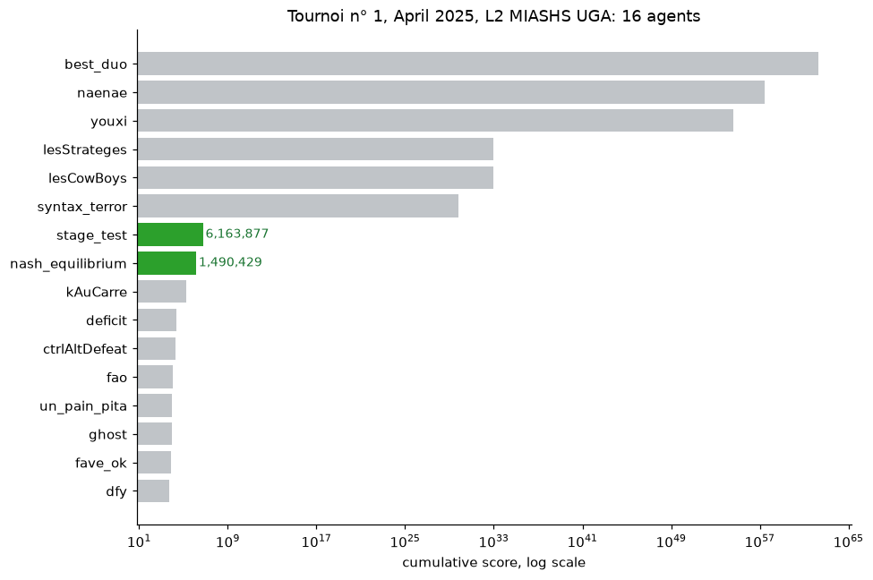
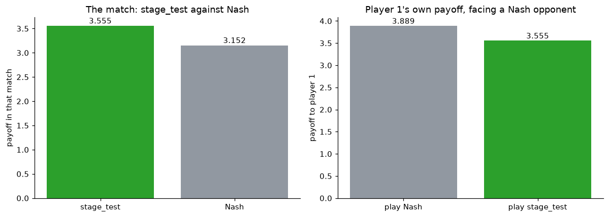
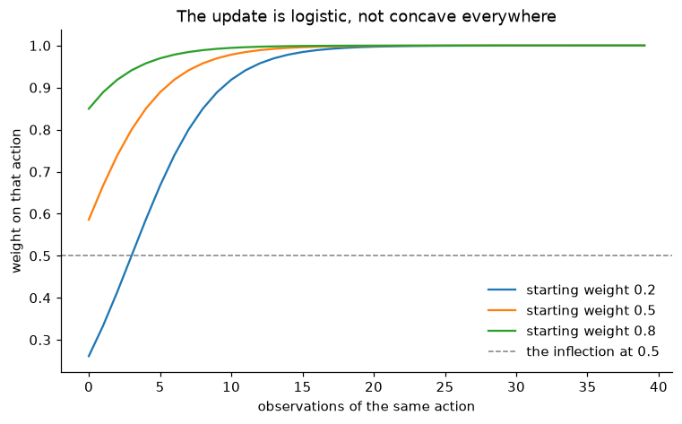

# AI & Strategic Pricing: GAEL research internship

> [Lire en français](README.fr.md)

> [!TIP]
> **Readable as a site:
> [tewf.github.io/IA-Economie-Strategique](https://tewf.github.io/IA-Economie-Strategique/)**
> The findings and figures on one page, with the report and slides opening in
> the browser rather than downloading.

In repeated price competition, human players tend to converge on tacitly
collusive prices rather than on the competitive equilibrium. Whether algorithms
sustain that behaviour, break it, or intensify it is an open question in
industrial economics, and one with direct consequences for competition policy.

A research internship at **GAEL** (Grenoble Applied Economics Laboratory,
UGA / INRAE) spent on that question: surveying where the literature stands,
modelling the imitation mechanism that might underpin cooperation, and building
agents to watch it happen.

**The internship did not settle the question**, and its report is a study rather
than a finding. What it did produce is below, with the numbers it actually
reached.

| | |
|---|---|
| **Intern** | L2 MIASHS, Université Grenoble Alpes |
| **Supervisors** | Alexis Garapin (UGA) and Olivier Bonroy (INRAE) |
| **Laboratory** | GAEL, Grenoble Applied Economics Laboratory |
| **Dates** | 23 January to 14 April 2025 |

## What it produced

| | |
|---|---|
|  | **[7th and 8th of 16](tournament/)** in the April 2025 L2 MIASHS UGA tournament, against thirteen other students' agents. `stage_test` scored 6,163,877 and `nash_equilibrium` 1,490,429. Both were beaten by six agents, the top three by more than fifty orders of magnitude. |
|  | **[The strategy beats Nash head to head](equilibrium/)**, 3.5552 against 3.1521. It does so by giving up absolute payoff: facing the same opponent, simply playing Nash earns 3.8889. Winning a match and scoring the most points are different objectives, which is why it placed 7th. |
|  | **[Imitation as a weight update](mirror_neurons/)**. Observing an action multiplies its weight and renormalises, and Tit-for-Tat falls out without being programmed. Six figures, rerun and seeded. |

The two entered agents' constants come straight out of the equilibrium notebook,
rounded. The analysis and the submitted Prolog are the same object, which is the
clearest evidence here that the work joins up end to end.

## How this repository is arranged

Two layers. The internship is preserved exactly as it was delivered, and the
corrections sit beside it rather than on top of it.

| | |
|---|---|
| [`original/`](original/) | Everything submitted in May 2025, byte for byte: the report, the slides, the bibliography, the Prolog agents, the notebooks. Nothing edited, including what is wrong with it, which that folder lists |
| [`equilibrium/`](equilibrium/) | The equilibrium analysis recomputed with the right condition |
| [`mirror_neurons/`](mirror_neurons/) | The simulation rerun so it terminates, is seeded, and has labelled figures |
| [`tournament/`](tournament/) | The standings, which were on page 1 of a 636-page log |

The corrections do not overturn the internship's conclusions. The head-to-head
result holds and reproduces exactly. What changed is that the derivation behind
it has been redone with a condition that is correct on a simplex, the claims the
code does not support are named, and the results that were buried are visible.

## Reading order

1. [`original/RapportDeStageFinal.pdf`](original/RapportDeStageFinal.pdf), the
   report, nine pages
2. [`tournament/`](tournament/) for what the agents actually did
3. [`equilibrium/`](equilibrium/) for the analysis behind them
4. [`original/Litterature/`](original/Litterature/) for the state of the art, as
   summaries written from the papers rather than the papers themselves

## Credits

Published papers are referenced rather than redistributed, and the Prolog
project brief belongs to its course. See [NOTICE](original/NOTICE).

One gap worth naming: Ng (2023), *When communicative AIs are cooperative
actors*, is summarised in `original/Litterature/Summary/` and analysed in the
report, but does not appear in that folder's bibliography. The bibliography lists
nine papers; this is a tenth.
