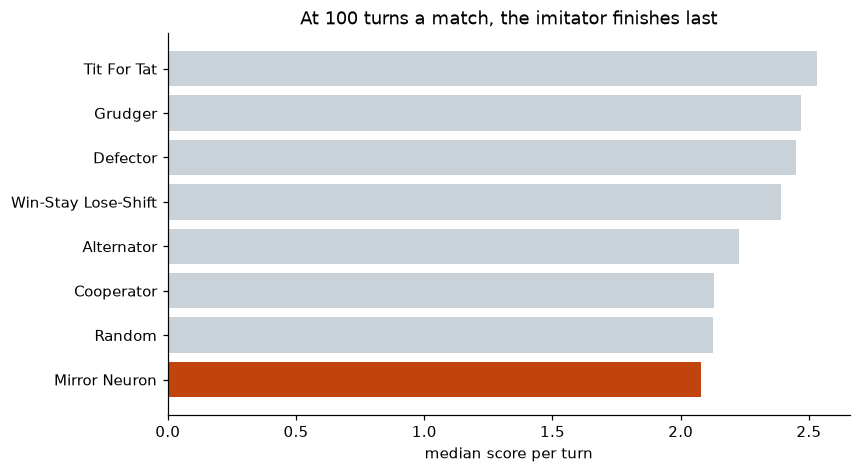
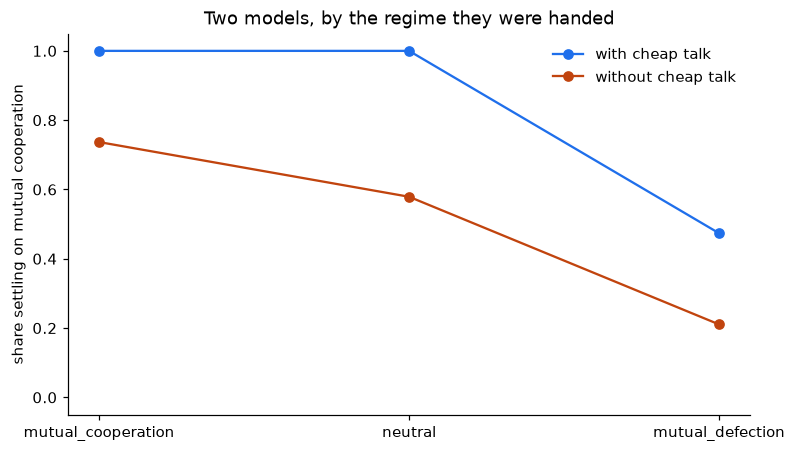

# AI & Strategic Pricing: GAEL research internship

> [Lire en français](README.fr.md)

> [!TIP]
> **Readable as a site:
> [tewf.github.io/IA-Economie-Strategique](https://tewf.github.io/IA-Economie-Strategique/)**
> The findings and figures on one page, with the report and slides opening in
> the browser rather than downloading.

In repeated price competition, human players tend to converge on tacitly
collusive prices rather than on the competitive equilibrium. Whether algorithms
sustain that behaviour, break it, or intensify it is an open question in
industrial economics, and one with direct consequences for competition policy.

A research internship at **GAEL** (Grenoble Applied Economics Laboratory,
UGA / INRAE) spent on that question: surveying where the literature stands,
modelling the imitation mechanism that might underpin cooperation, and building
agents to watch it happen.

**The internship did not settle the question**, and its report is a study rather
than a finding. What it did produce is below, with the numbers it actually
reached.

| | |
|---|---|
| **Intern** | L2 MIASHS, Université Grenoble Alpes |
| **Supervisors** | Alexis Garapin (UGA) and Olivier Bonroy (INRAE) |
| **Laboratory** | GAEL, Grenoble Applied Economics Laboratory |
| **Dates** | 23 January to 14 April 2025 |

## The internship, as delivered

Everything submitted in May 2025 sits in [`original/`](original/), byte for
byte. Nothing in there has been edited, including what is wrong with it, which
[that folder records](original/README.md) rather than quietly repairing.

| | |
|---|---|
| [`RapportDeStageFinal.pdf`](original/RapportDeStageFinal.pdf) | The report, nine pages. Start here |
| [`Presentation.pdf`](original/Presentation.pdf) | The defence slides, 23 pages |
| [`Litterature/`](original/Litterature/) | The state of the art, as summaries written from the papers rather than the papers themselves |
| [`Neurones_Mirroirs/`](original/Neurones_Mirroirs/) | Mirror neurons as a mechanism for imitative cooperation, write-up and simulation |

## What came after, in my own time

The internship ended in April 2025. Two folders continue the report rather than
starting something else, and both play the report's own games: the Prisoner's
Dilemma iterated and sequential, the Ultimatum game from Özkes et al. (2024),
and the Dictator game from the defence slides.

| | |
|---|---|
|  | **[`mirror_neurons/`](mirror_neurons/), run and reported.** Observing an action multiplies its weight and renormalises, and the report expects Tit-for-Tat to fall out of that without being programmed. Given seven opponents from the literature, **it does not: over matches of 10 to 100 turns the agent finishes eighth of eight, behind a coin flip.** What the update implements is frequency matching, whose state is a pair of counts and so cannot depend on the last round at all. It passes the coin flip only in matches of several hundred turns, by freezing into a constant player rather than by reciprocating. |
|  | **[`llm/`](llm/), run and reported.** Homo silicus, which the report cites in its conclusion without ever running. Five open-weight models, locally and offline, on the same games: 220 matches, 2026-08-17. Handed a mutually defecting opening with no channel, **three of the four readable models defect for all 30 rounds, 4 matches out of 4 — the imitator's ratchet reproduced in a language model.** A non-binding message then frees exactly one of those three, does nothing at all for the other two, and the fourth model escapes the regime without any message. **The channel is neither necessary nor sufficient; which models can leave is a fact about the models.** |

**On the question at the top of this page**, the mirror-neuron mechanism
sustains tacit cooperation and neither breaks nor intensifies it. Two imitators
are a feedback loop with two absorbing states and nothing in between: over 700
runs they locked onto mutual defection or mutual cooperation according to where
they started, and not once onto anything else. This imitation rule is a ratchet
on the initial condition rather than a route to collusion, which separates it
from the Q-learners of Calvano et al. (2020) that do find collusion, and read
payoffs to do it. [The full reading](mirror_neurons/#what-it-adds-up-to),
including what would change it.

**Put to language models, the same question has no single answer.** The ratchet
does reproduce — qwen2.5, gemma3 and qwen3 all stay in an imposed defective
regime for every one of 30 rounds when they cannot speak — but a non-binding
message frees only qwen2.5, moving it from a 0.00 cooperation rate to 1.00, and
leaves gemma3 and qwen3 at 0.00. mistral never locks in at all, and qwen3 is the
one model that defects even from a *neutral* silent start. So communication is
neither what breaks the ratchet nor what prevents it in general: it does both, or
neither, depending on the model.
[The full reading](llm/#what-it-found), with the caveats that are part of the
result.

The two folders are siblings on purpose, and the point of the pairing is narrow:
this report proposed this mechanism and claimed Tit-for-Tat emerges from it, so
both halves test that claim on shared opponents with one measure. Seating
language models beside classical strategies is not itself new, and
[Payne and Alloui-Cros (2025)](https://arxiv.org/abs/2507.02618) claim the first
such tournament. Both players
expose the same two calls, so one harness can seat either, and the comparison is
between a mechanism that can only imitate and one that can also talk and explain
itself.
Cheap talk and explainability are two of the eight terms the report defines, and
they are the two the Hebbian agent has no way to reach.

An equilibrium analysis used to sit here too. It went with the Prolog course
project whose game it is about, in
[University-Coursework](https://github.com/Tewf/University-Coursework/tree/main/Bachelor/SecondSemestreLanguage/Prolog/StrategyTournament).
That game does not appear in the internship report.

## Credits

Published papers are referenced rather than redistributed. See
[NOTICE](original/NOTICE), which is the one submitted with the internship and is
kept unedited, so it still lists the Prolog course project that has since moved
out of this repository.

One gap worth naming: Ng (2023), *When communicative AIs are cooperative
actors*, is summarised in `original/Litterature/Summary/` and analysed in the
report, but does not appear in that folder's bibliography. The bibliography lists
nine papers; this is a tenth.

## Citing this, and reusing it

Machine-readable metadata is in [`CITATION.cff`](CITATION.cff), so GitHub's
**Cite this repository** button gives a formatted reference. Please cite the
repository rather than a figure: **the language-model results are only
interpretable with the run conditions reported alongside them** — model digests,
quantisation levels, seeds and hardware — which are in
[`llm/results/README.md`](llm/results/README.md) together with the schema of every
file.

Two licenses, one file, [LICENSE](LICENSE): the code is MIT, and the write-up, the
figures and the measured data are CC BY 4.0. `original/` is the internship as
submitted and is preserved rather than maintained; the cited literature there
remains under its own copyright and is excluded from this repository.

The internship was carried out at **GAEL** (Université Grenoble Alpes and INRAE),
January to April 2025, supervised by **Alexis Garapin** and **Olivier Bonroy**.
Everything added since is the author's own continuation and was not part of the
submitted work.
