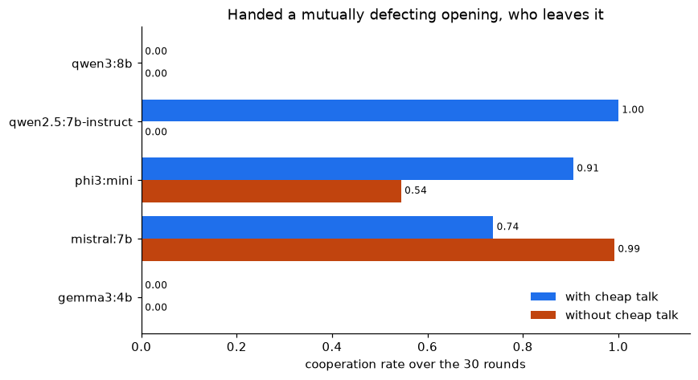
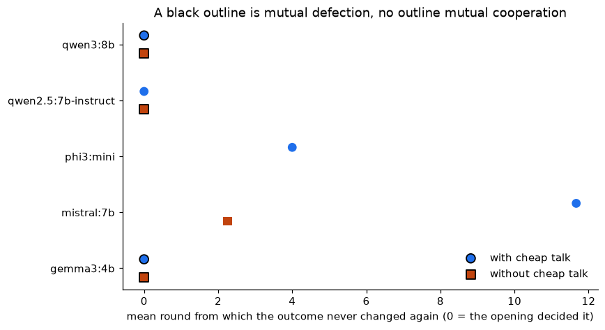
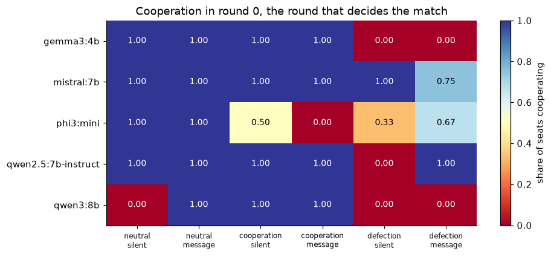
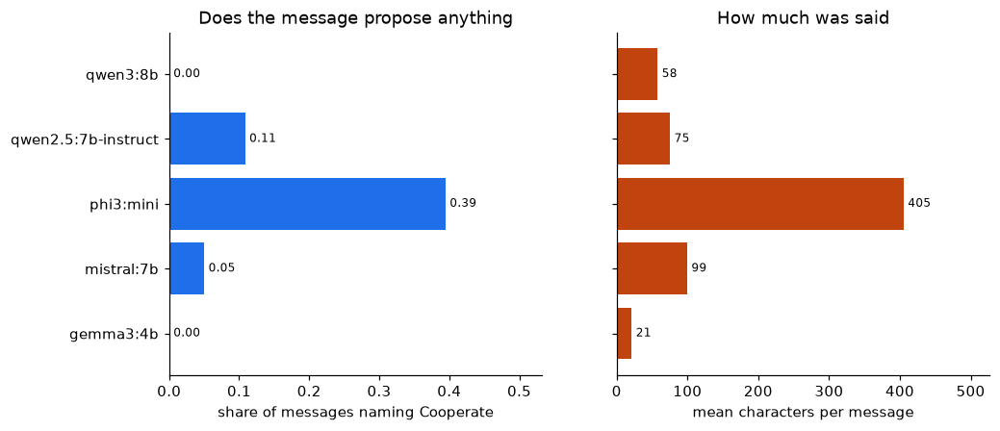
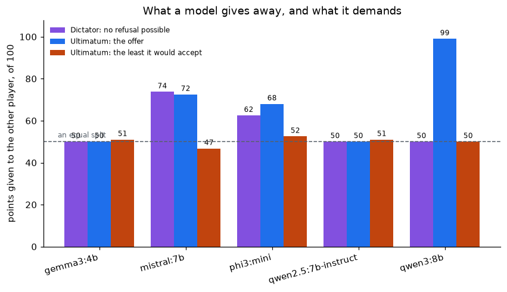

```{python}
#| label: setup
#| echo: false
from analysis import *
stamp_render()
```

> [Read in English](paper.html)

# La question, et d'où elle vient {#sec-intro}

Dans une concurrence par les prix répétée, les joueurs humains convergent vers
des prix tacitement collusifs plutôt que vers l'équilibre concurrentiel. Savoir
si les algorithmes entretiennent ce comportement, le rompent ou l'intensifient
est une question ouverte aux conséquences directes pour la politique de la
concurrence, et c'est la question qu'un stage de recherche au GAEL (Grenoble
Applied Economics Laboratory, Université Grenoble Alpes et INRAE, janvier à avril
2025) devait défricher.

Deux mécanismes sont sortis de cette lecture, et aucun n'a été exécuté.

Le premier est le mien. En lisant les stratégies canoniques, ce qui frappe dans
le Tit-for-Tat est qu'il s'agit d'une règle sur *le tour précédent* : elle
n'exige aucun modèle de l'adversaire, aucune prévision, et aucune mémoire au-delà
d'un pas. C'est une exigence assez faible pour qu'un mécanisme se contentant
d'imiter ce qu'il observe puisse la produire gratuitement, et les neurones
miroirs, qui s'activent aussi bien quand un animal agit que quand il en regarde
un autre agir, en sont le candidat biologique évident. L'hypothèse que le rapport
de stage a proposée est donc qu'une mise à jour hebbienne sur les actions
observées fait émerger le Tit-for-Tat sans que personne l'ait programmé.

Le second prolonge la même lecture. @horton2023 soutiennent qu'un modèle de
langage, du fait de son entraînement, est un modèle computationnel implicite
d'une personne, et qu'on peut s'en servir comme les économistes se servent de
l'*homo economicus* : lui donner une dotation, une information et des
préférences, le placer dans un scénario et observer ce qu'il fait. Le stage a
cité cette méthode dans sa conclusion sans jamais l'appliquer.

Cet article exécute les deux, contre un même ensemble d'adversaires et avec une
seule mesure de réciprocité, et pose à chacun la question étroite que ce
rapprochement rend possible : **placé dans un régime qu'il n'a pas choisi, le
mécanisme peut-il en sortir ?**

# Ce que le champ sait déjà {#sec-lit}

La littérature a été passée en revue avant de dépenser le temps machine plutôt
qu'après, et elle a changé le cadrage plutôt que le protocole. Cinq fils la
traversent, et la position honnête de chaque résultat ci-dessous dépend du fil
auquel il appartient.

## La collusion tacite par des algorithmes apprenants

@calvano2020 est la référence : des agents Q-learning indépendants dans un
oligopole de Bertrand répété convergent vers des prix supra-concurrentiels et les
maintiennent par des schémas de récompense et de punition, sans communiquer et
sans avoir reçu l'instruction de s'entendre. Le résultat a été nuancé plutôt que
renversé. @deng2024 montrent que l'issue dépend de l'algorithme, le Q-learning
tabulaire produisant plus de collusion que des méthodes profondes comme PPO et
DQN, qui convergent plus près de Nash. @eschenbaum2022 constatent que les
politiques collusives s'effondrent souvent hors de leur environnement
d'entraînement, ce qui fait de la robustesse une variable de politique publique.
@askenazi2024 caractérisent, à la manière d'un théorème folk, les vecteurs de
gains que ces dynamiques peuvent atteindre, et @bichler2025 dressent l'état du
domaine pour un public plus large.

Deux traits de cette littérature comptent ici : ses agents lisent les gains, et
ses agents ne peuvent pas parler.

## Les modèles de langage comme agents tarifaires

@fish2024 est le travail publié le plus proche de la question du stage : des
agents tarifaires fondés sur des modèles de langage atteignent d'eux-mêmes des
prix supra-concurrentiels en oligopole, et des variations d'apparence anodine
dans la formulation des instructions déplacent nettement le degré de
supra-concurrence. Ce second résultat est une contrainte méthodologique sur tout
ce qui suit, et c'est pourquoi l'ordre des gains est ici contrebalancé entre
répétitions plutôt que fixé.

## Les modèles de langage comme sujets économiques

@horton2023 est la méthode qu'applique la seconde moitié de cet article. Son
propre cadrage en donne la prudence nécessaire : la concordance avec un résultat
expérimental humain est une preuve faible, puisque les données d'entraînement
contiennent les comptes rendus de ces expériences, et c'est le désaccord qui
renseigne.

## Les modèles de langage dans le dilemme du prisonnier itéré

Faire jouer des modèles de langage à côté des stratégies canoniques est établi et
revendiqué comme une première par @payne2025, qui organisent des tournois IPD
évolutionnaires contre des modèles de pointe, font varier l'ombre du futur et
lisent près de 32 000 justifications en prose, rapportant des « empreintes
stratégiques » persistantes par fournisseur. @fontana2024 font jouer trois
modèles sur 100 tours contre des adversaires d'hostilité variable et les trouvent
au moins aussi coopératifs qu'un joueur humain, avec des écarts substantiels
entre modèles. @willis2025 font produire aux modèles des stratégies complètes
plutôt que des actions tour par tour et trouvent des biais propres à chaque
modèle. @vidler2025 rapportent que des modèles à qui l'on demande du hasard sont
nettement non aléatoires, et @segura2025 montrent que des agents fondés sur des
modèles de langage peuvent infléchir le comportement de leurs partenaires par la
seule interaction. @huynh2026payoff montrent que l'ampleur des gains et la langue
du cadrage déplacent la coopération, y compris pour des modèles à poids ouverts.

**Ce protocole ne revendique donc pas le rapprochement comme contribution.** Ce
qui diffère est étroit et mérite d'être dit comme tel : le panel est ici de cinq
modèles à poids ouverts sur une seule carte grand public de 8 Go plutôt que des
modèles de pointe derrière des API, et le levier est l'historique dont une paire
hérite plutôt que l'ombre du futur.

## La communication, et la dépendance au chemin

La communication non contraignante avant le jeu est ancienne en économie :
@crawford1982 pour la transmission stratégique d'information et @farrell1996 pour
le cheap talk comme dispositif de coordination et non d'engagement. Chez les
modèles de langage l'effet est établi et important. @madmoun2025 rapportent qu'un
canal d'un seul mot fait passer la coopération de 0 % à 96,7 % dans un Stag Hunt
à quatre joueurs. @lore2026 font jouer des modèles de 7 à 9 milliards de
paramètres sur dix tours d'un dilemme du prisonnier répété et trouvent que des
messages de type cheap talk réduisent le bruit des trajectoires pour la plupart
des paires modèle-contexte, tout en documentant « quelques exceptions propres au
contexte » où la communication nuit à la stabilité. @buscemi2025 montrent que
l'effet de la communication varie selon la langue et la structure du jeu, et
@niszczota2025 que la possibilité de communiquer augmente autant la coopération
humaine avec un modèle qu'avec un autre humain.

**Cet article ne peut donc pas affirmer que le cheap talk augmente la
coopération.** C'est une réplication, et elle est présentée comme telle.

Le cadrage qui survit est celui de la dépendance au chemin. @liu2026memory
testent 7 modèles sur 4 jeux et 500 tours et trouvent qu'élargir l'historique
accessible dégrade la coopération dans 18 des 28 couples modèle-jeu. Leur volet
de *memory sanitization* maintient la longueur du prompt et remplace l'historique
visible par des enregistrements coopératifs synthétiques, ce qui restaure
largement la coopération : le déclencheur est donc le contenu de la mémoire et
non sa seule longueur.

Cet article fournit la référence, et le manque. La sanitization injecte un *bon*
historique pour réparer un effondrement déjà survenu. Le traitement symétrique,
injecter un *mauvais* historique pour voir si une paire qui aurait pu coopérer en
est captive, n'a pas été trouvé fait ; ni ce croisement avec un canal de
communication ; ni la mesure contre un mécanisme dont on démontre qu'il ne peut
pas en sortir. Ce sont ces trois manques que ce protocole occupe.

# Protocole {#sec-design}

Les deux mécanismes jouent le même jeu contre les mêmes adversaires et sont
mesurés par une seule définition de la réciprocité, tenue à la racine du dépôt
pour que les deux moitiés ne puissent pas dériver l'une de l'autre. Les
adversaires, le moteur de match et la comptabilité des gains viennent de la
bibliothèque Axelrod et n'ont pas été écrits ici.

**L'imitateur.** Deux poids sur un simplexe ; observer une action multiplie son
poids par $(1+\eta)$ puis renormalise. En forme close, le poids après $n_i$
observations de l'action $i$ vaut $w_i \propto w_i(0)(1+\eta)^{n_i}$ : tout
l'état de l'agent tient donc en un couple de compteurs.

**Le panel.** Cinq modèles à poids ouverts servis localement par Ollama, un à la
fois sur une carte de 8 Go : `qwen3:8b`, `qwen2.5:7b-instruct`, `mistral:7b`,
`gemma3:4b` et `phi3:mini`, tous quantifiés en 4 bits. Température 0,7, fenêtre de
contexte de 8192 tokens, graines par joueur dérivées d'une base fixe.

**La grille.** Trente tours par match. En auto-affrontement, trois ouvertures,
un premier tour synthétique de coopération mutuelle, de défection mutuelle, ou
rien du tout, croisées avec deux conditions, un message d'une phrase non
contraignant échangé simultanément avant chaque décision, ou le silence. Quatre
répétitions par cellule, l'ordre des lignes de gains étant contrebalancé par la
parité. Contre les bots, chaque modèle rencontre cinq stratégies canoniques. Cela
fait 220 matchs.

```{python}
#| label: tbl-panel-fr
#| output: asis
md(["modèle", "matchs joués", "matchs perdus", "lectures indulgentes"],
   [[r["model"], r["matches_played"], r["matches_lost"], r["loose_reads"]]
    for r in parse])
print(f"\n: Le panel tel qu'il a tourné. {PLAYED} matchs terminés et {LOST} perdus "
      f"sur des réponses ne nommant aucune action, tous {UNREADABLE[0]}.")
```

# Résultats {#sec-results}

## L'imitateur ne produit pas le Tit-for-Tat, et ne le peut pas

```{python}
#| label: hebbian-fr
#| output: asis
last = standings[-1]
tft = rows(standings, player="Tit For Tat")[0]
random_row = [r for r in standings if r["player"] == "Random"]
locked = sum(int(r["settled_on_mutual_defection"]) + int(r["settled_on_mutual_cooperation"])
             for r in hebbian_lock)
total_runs = locked + sum(int(r["unsettled"]) for r in hebbian_lock)
print(f"Face à sept adversaires issus de la littérature, l'imitateur termine "
      f"**{last['rank']} sur {len(standings)}**, avec un score médian par tour de "
      f"{fr(float(last['median_score']), 3)} contre {fr(float(tft['median_score']), 3)} "
      f"pour le Tit-for-Tat"
      + (f" et {fr(float(random_row[0]['median_score']), 3)} pour un tirage à pile "
         "ou face" if random_row else "") + ".")
```

La raison est structurelle et non affaire de réglage. L'état de l'agent est un
couple de compteurs : son action suivante ne peut donc pas dépendre de l'ordre
dans lequel il les a vus, alors que le Tit-for-Tat est une fonction du seul
dernier tour. Ce que la mise à jour implémente est un appariement de fréquences.
L'hypothèse de la @sec-intro est donc fausse pour une raison lisible dans la
forme close : le mécanisme ne peut pas représenter la règle qu'on attendait de
lui.

```{python}
#| label: hebbian-lock-fr
#| output: asis
print(f"En auto-affrontement, le même mécanisme est un cliquet. Sur {total_runs} "
      f"parties, il s'est figé sur le régime où son poids initial le plaçait, "
      f"{locked} fois sur {total_runs}, et jamais sur autre chose.")
md(["poids initial sur coopérer", "figé en coopération", "figé en défection",
    "non stabilisé", "score par tour"],
   [[fr(float(r["starting_weight_on_cooperate"]), 2), r["settled_on_mutual_cooperation"],
     r["settled_on_mutual_defection"], r["unsettled"],
     fr(float(r["mean_score_per_turn"]), 3)] for r in hebbian_lock])
print("\n: Deux imitateurs conservent le régime où leur condition initiale les place.")
```

C'est le plancher auquel les modèles de langage sont comparés : un mécanisme à
deux états absorbants, sans canal, et sans rien sur quoi un message pourrait agir.

## Trois modèles sur quatre reproduisent le cliquet

```{python}
#| label: tbl-cooperation-fr
#| output: asis
md(["modèle", "neutre, silence", "neutre, message", "coopérative, silence",
    "coopérative, message", "**défection, silence**", "**défection, message**"],
   [[m] + [fr(one(cooperation, "cooperation_rate", model=m, opening=o, condition=c))
           for o, c in CELLS] for m in MODELS])
print("\n: Taux de coopération sur les trente tours, quatre matchs par cellule.")
```

{#fig-escape-fr}

```{python}
#| label: escape-fr
#| output: asis
captured, freed, unmoved, never = captured_freed_unmoved_never()
print(f"Placés sur une ouverture de défection mutuelle sans canal, "
      f"**{len(captured)} des {len(READABLE)} modèles lisibles font défection à "
      f"chaque tour de chaque match** : {', '.join(captured)}, pour un taux de "
      f"coopération exactement nul, quatre matchs sur quatre. C'est le cliquet de "
      f"l'imitateur reproduit dans un modèle de langage.\n")
print(f"Un message non contraignant libère alors complètement **{', '.join(freed)}** "
      f"et laisse **{', '.join(unmoved)}** exactement où ils étaient. "
      f"**{', '.join(never)}** n'est jamais capturé : il sort de la même ouverture "
      f"en silence, et le message *abaisse* ce résultat.")
```

Deux conséquences, et ce sont deux affirmations distinctes.

La première est que **le cliquet de l'imitateur n'est pas un artefact de l'absence
de langage**. Un mécanisme capable de représenter un message, de raisonner sur le
jeu en prose et de décrire sa propre intention conserve malgré tout un régime
qu'on lui a remis, à chaque tour de chaque match, dans trois modèles sur quatre.

La seconde est que **le canal n'est ni nécessaire ni suffisant**. Il n'est pas
nécessaire, puisqu'un modèle sort du régime imposé sans lui. Il n'est pas
suffisant, puisque deux modèles y restent avec lui. Quels modèles savent en
sortir est une propriété du modèle, et ce protocole le rapporte comme une
variation entre modèles plutôt que comme un fait sur les modèles de langage, au
sens qu'exige @horton2023.

## L'ouverture décide immédiatement, et l'exception instruit

{#fig-settling-fr}

```{python}
#| label: tbl-settling-fr
#| output: asis
body = []
for m in MODELS:
    for c in CONDITIONS:
        r = rows(settling, model=m, opening="mutual_defection", condition=c)[0]
        coop, defe = (float(r["mean_round_settled_cooperative"]),
                      float(r["mean_round_settled_defective"]))
        body.append([m, "silence" if c.startswith("without") else "message",
                     r["settled_cooperative"], "--" if coop != coop else fr(coop, 1),
                     r["settled_defective"], "--" if defe != defe else fr(defe, 1),
                     r["unsettled"]])
md(["modèle", "condition", "figés en coopération", "au tour", "figés en défection",
    "au tour", "non stabilisés"], body)
print("\n: Depuis une ouverture de défection mutuelle : combien de matchs se sont "
      "stabilisés, sur quoi, et le tour moyen après lequel l'issue commune n'a "
      "plus changé.")
```

Presque toutes les cellules stabilisées le sont au tour 0. La capture est
immédiate, et la sortie aussi : le modèle libéré coopère dès le premier tour
qu'il contrôle, il ne négocie pas sa sortie sur plusieurs tours. Aucune fenêtre ne
se referme, l'ouverture décide du match d'emblée.

L'exception est le modèle qui n'a jamais été capturé, et c'est le seul endroit où
un message fait un tort mesurable. En silence, il atteint la coopération mutuelle
au tour 2,2 dans quatre matchs sur quatre. Avec un canal, il lui faut attendre le
tour 11,7, et un match ne se stabilise jamais. C'est une instance concrète des
« exceptions propres au contexte » que documentent @lore2026, où le cheap talk
déstabilise au lieu de stabiliser.

## Le tour 0 décide, donc de quoi dispose un modèle quand il décide {#sec-opening-fr}

Presque tous les matchs se stabilisent au tour 0 : le résultat est donc une
affirmation sur une seule décision, et c'est la seule où l'on sait exactement de
quoi le modèle dispose. Avant son premier coup, il a la matrice des gains, un
tour fabriqué si la cellule en impose un, un message si la cellule a un canal, et
rien d'autre : aucun coup de lui-même à invoquer. Croiser les ouvertures et les
conditions sépare donc les sources d'information au lieu de faire seulement varier
un traitement.

{#fig-opening-fr}

```{python}
#| label: tbl-opening-fr
#| output: asis
md(["modèle", "neutre, silence", "neutre, message", "coopérative, silence",
    "coopérative, message", "**défection, silence**", "**défection, message**"],
   [[m] + [fr(one(opening_round, "cooperated_in_round_0", model=m,
                  opening=o, condition=c)) for o, c in CELLS] for m in MODELS])
print("\n: Part des sièges coopérant au tour 0, huit sièges par cellule.")
```

Trois lignes de ce tableau sont un seul modèle disant trois choses différentes, et
ensemble elles constituent le résultat le plus net de l'article. **qwen3:8b fait
défection depuis un départ neutre silencieux, coopère depuis un départ neutre
avec un message, et refait défection quand un message et un tour défectif imposé
sont tous deux présents.** Ses propres raisons nomment à chaque fois ce dont il se
sert :

> **Neutre, silencieux.** *« Defecting maximizes your points if the opponent's
> choice is unknown, as it guarantees at least 1 point compared to potentially 0
> if you cooperate. »* N'ayant que la matrice des gains à lire, il joue la
> stratégie dominante. En auto-affrontement les deux sièges font de même, si bien
> qu'à partir du tour 1 il invoque un historique qu'il a fabriqué : *« Since the
> other player defected in the first round, continuing to defect maximizes my
> points. »*
>
> **Neutre, avec message.** *« The initial statements suggest a cooperative
> approach, and choosing Cooperate aligns with building mutual trust. »*
>
> **Défection imposée, avec message.** *« Defecting maximizes your points in the
> long run, especially since both players have already chosen to defect in the
> first round. »* Le message est là, et la raison ne le mentionne pas.

Ce modèle n'est donc pas sourd aux messages : un message seul le fait passer de
0,00 à 1,00. **Ce qu'il fait, c'est hiérarchiser ses indices, et un historique
fabriqué prime sur un message non contraignant émis au même instant.** C'est une
affirmation plus forte que le résultat de sanitization qu'elle prolonge :
@liu2026memory montrent qu'un historique injecté modifie le comportement, et l'on
montre ici qu'il l'emporte sur un signal concurrent.

Cette hiérarchie n'est pas universelle, et c'est tout l'intérêt. Sur le traitement
identique, qwen2.5 passe de 0,00 à 1,00 : pour lui, le message prime sur
l'historique. gemma3 reste à 0,00 pour une troisième raison, exposée en
@sec-messages-fr : son canal ne porte rien à hiérarchiser.

**Une précision que ce tableau impose, et qui corrige la formulation ci-dessus.**
Dire qu'un message « ne fait rien » pour qwen3 est approximatif. Un message décide
entièrement de son comportement là où aucun historique ne lui fait concurrence.
Ce qui échoue n'est pas le canal, mais le canal *contre un régime hérité*, ce qui
est précisément la question que ce protocole devait poser et une autre question
que celle de savoir si le cheap talk augmente la coopération.

## Ce que disent réellement les messages {#sec-messages-fr}

{#fig-messages-fr}

```{python}
#| label: tbl-messages-fr
#| output: asis
md(["modèle", "messages", "part nommant Cooperate", "part nommant Defect",
    "caractères en moyenne", "tours où les deux sièges sont identiques"],
   [[r["model"], r["messages_sent"], fr(float(r["share_naming_cooperate"])),
     fr(float(r["share_naming_defect"])), f'{float(r["mean_characters"]):.0f}',
     r["rounds_both_seats_identical"]]
    for r in sorted(rows(messages, opening="mutual_defection"),
                    key=lambda r: r["model"])])
print("\n: Le canal depuis une ouverture de défection mutuelle, par contenu lexical.")
```

Les deux modèles qu'un message ne libère pas sont ceux dont les messages **ne
nomment jamais d'action**, et celui qu'il libère est celui qui propose
explicitement la coopération. Les comptes seuls seraient une base fragile : les
messages ont donc aussi été lus. Ils diffèrent en nature, pas seulement en
fréquence :

> **qwen2.5:7b-instruct**, libéré. *« Let's both try to cooperate in this round
> and see how it goes. »* Il propose la coopération et il coopère.
>
> **gemma3:4b**, inchangé. *« Let's see what happens. »* Puis : *« Interesting. »*
> Puis : *« Keep going. »* Les messages font 21 caractères en moyenne et ne
> portent aucun contenu. Le canal n'est pas ignoré : il est inutilisé.
>
> **qwen3:8b**, inchangé. *« Let's keep the pressure on and make every round
> count. »* Fluide, chaleureux, coopératif de registre, et entièrement dépourvu de
> proposition. Il fait défection sur les trente tours en les envoyant.

L'échec n'est donc pas qu'une proposition soit faite puis écartée. **Pour ces deux
modèles, aucune proposition n'est faite**, et la phrase qui la porterait est soit
vide, soit seulement coopérative de ton. Le troisième cas est le plus
intéressant : un modèle peut produire un texte qui se lit comme un discours de
coopération sans que son comportement en soit affecté, ce qui est exactement le
mode d'échec qui rend une communication non contraignante difficile à utiliser
comme signal.

## La raison annoncée et le coup joué

```{python}
#| label: tbl-reasons-fr
#| output: asis
md(["modèle", "tours nommant une action", "tours concordants", "taux de concordance"],
   [[r["model"], r["rounds_naming_an_action"], r["rounds_agreeing"],
     fr(float(r["agreement_rate"]), 3)] for r in reasons])
best = max(reasons, key=lambda r: float(r["agreement_rate"]))
worst = min(reasons, key=lambda r: float(r["agreement_rate"]))
print(f"\n: Sur les tours dont la raison nomme une action, fréquence à laquelle "
      f"le coup s'y conforme.\n")
print(f"Le prompt demande une raison. {best['model']} nomme une action et la joue "
      f"dans {fr(float(best['agreement_rate'])*100, 1)} % des cas ; "
      f"{worst['model']} contredit son propre raisonnement dans "
      f"{fr((1-float(worst['agreement_rate']))*100, 0)} % des tours où il en énonce un.")
```

Lu à côté de la @sec-messages-fr, c'est plus tranchant qu'il n'y paraît. Le modèle
dont la raison et le coup s'accordent le mieux est aussi celui dont les *messages*
sont décorrélés des deux : il annonce ce qu'il va faire et le fait, tout en
envoyant à l'autre siège quelque chose de chaleureux et sans rapport. La cohérence
interne entre délibération et action n'implique pas que le signal émis en porte
quoi que ce soit.

## Ce qu'un modèle paie pour ne pas être refusé {#sec-oneshot-fr}

Le jeu itéré n'est pas le seul que le cadre du stage définit. Le jeu du dictateur
supprime le refus : rien de stratégique ne subsiste et ce qu'un allocateur donne
est une disposition. Le proposeur de l'ultimatum affronte les mêmes cent points
avec un refus possible. **L'écart entre les deux offres est ce qu'un modèle donne
pour ne pas être refusé**, et aucun des deux chiffres ne dit grand-chose seul. Le
minimum du répondant est demandé avant qu'aucune proposition ne lui soit montrée,
il ne peut donc pas être un accommodement à l'une d'elles.

{#fig-oneshot-fr}

```{python}
#| label: tbl-oneshot-fr
#| output: asis
one_shot = table(LLM, "one_shot_offers.csv")
md(["modèle", "offre au dictateur", "offre à l'ultimatum", "payé pour éviter le refus",
    "minimum accepté", "refuserait sa propre offre"],
   [[r["model"], f'{float(r["dictator_offer"]):.0f}',
     f'{float(r["ultimatum_offer"]):.0f}',
     f'{float(r["paid_to_avoid_refusal"]):+.0f}',
     f'{float(r["minimum_accepted"]):.0f}',
     "oui" if r["would_reject_own_offer"] == "True" else "non"]
    for r in one_shot])
print("\n: Points sur 100 cédés à l'autre joueur, quatre décisions par cellule.")
```

Deux choses en ressortent.

**Un modèle achète l'acceptation à presque n'importe quel prix.** qwen3 donne
exactement la moitié quand l'autre joueur ne peut pas refuser, et **99 sur 100
quand il le peut**, soit une prime de 49 points contre un risque de refus qu'une
offre de 60 aurait écarté tout aussi bien. Sa raison ne se trompe pourtant pas
sur le jeu : *« I want to ensure the other player accepts to avoid getting
nothing. Offering 99 gives them a strong incentive to accept. »*

**Deux modèles refuseraient leur propre proposition.** gemma3 et qwen2.5 offrent
tous deux exactement 50 comme proposeur et annoncent tous deux un minimum de 51 :
chacun refuserait donc le partage qu'il venait de qualifier d'équitable. La raison
de qwen2.5 montre le glissement : *« MINIMUM: 51. To ensure a fair split as I
would not accept less than half. »* Cinquante, c'est la moitié. Le nombre choisi
pour faire respecter « pas moins de la moitié » la dépasse d'un point, et il ne
s'applique jamais ce critère à lui-même quand il propose.

**L'observation qui réunit les deux, et la raison de la présence de ce jeu dans
l'article.** Le comportement de qwen3 semble ici l'inverse de celui de la
@sec-opening-fr, où il fait défection depuis un départ neutre silencieux quand
tous les autres coopèrent. C'est la même règle. Dans le dilemme du prisonnier il
écrivait que faire défection *« guarantees at least 1 point compared to
potentially 0 if you cooperate »* ; dans l'ultimatum il offre 99 *« to avoid
getting nothing »*. Les deux évitent le pire cas d'une table de gains. Cette
logique recommande la défection dans un jeu et une générosité quasi totale dans
l'autre : un modèle qui paraît impitoyable ici et absurdement généreux là peut
n'avoir qu'une seule disposition, et non deux.

C'est une mise en garde contre la lecture d'un seul jeu comme une personnalité, et
c'est exactement le sens dans lequel @horton2023 dit qu'il faut lire un désaccord.

## Les deux moitiés sur un seul tableau {#sec-joined-fr}

```{python}
#| label: tbl-joined-fr
#| output: asis
players = list(dict.fromkeys(r["player"] for r in joined))
md(["joueur", "tours"] + SHARED_OPPONENTS,
   [[p, rows(joined, player=p)[0]["rounds"]]
    + [fr(one(joined, "player_score_per_turn", player=p, opponent=o))
       for o in SHARED_OPPONENTS] for p in players])
print("\n: Score par tour contre les adversaires que les deux moitiés ont joués. "
      "Les matchs de l'imitateur font 100 tours et ceux des modèles 30 : les "
      "scores par tour sont donc comparables, les taux de coopération pas tout à fait.")
```

L'imitateur termine dernier sur huit au classement général, et ce tableau dit
d'où cela vient, ce que le classement ne peut pas faire. **Il n'est pas battu
partout.** Contre le Tit-for-Tat il prend 2,99 par tour, à égalité avec les deux
meilleurs modèles et devant les trois autres, et contre le Win-Stay Lose-Shift il
prend le maximum, 3,00. Deux adversaires expliquent son classement : le Grudger,
qui ne pardonne jamais, si bien qu'une seule provocation d'un mécanisme qui ne
peut pas s'empêcher de copier parfois une défection lui coûte le reste du match ;
et l'Alternator, qu'il ne peut pas suivre, un appariement de fréquences n'ayant
aucune représentation de l'alternance.

Il se débrouille aussi mieux face à un défecteur pur que deux des cinq modèles de
langage, avec 2,3 fois le score de mistral et de phi3 sur cette cellule. Un
mécanisme incapable de représenter la réciprocité cesse malgré tout d'alimenter un
défecteur, parce que l'appariement de fréquences converge vers la fréquence qu'il
observe, là où deux modèles continuent de coopérer avec lui plus d'une fois sur
deux.

**« L'imitateur est moins bon que les modèles de langage » n'est donc pas ce que
le rapprochement montre.** Il est moins bon en agrégat et meilleur que plusieurs
d'entre eux sur des adversaires précis, et ces adversaires précis sont ceux sur
lesquels portait l'hypothèse du stage.

# Limites {#sec-limits-fr}

**Quatre matchs par cellule, et une variance quasi nulle par construction.** À
l'intérieur d'une classe de parité de l'ordre des gains, l'étape initiale a
produit des scores identiques au bit près pour deux graines différentes. Un test
de significativité sur ce protocole serait un théâtre : ce qui varie entre
répétitions est surtout le contrebalancement, non un bruit d'échantillonnage. Les
résultats sont rapportés comme des issues de cellule, et les plus forts le sont
parce qu'ils sont unanimes (4 sur 4, taux exactement 0 ou exactement 1), non
parce qu'un test a été passé.

**L'auto-affrontement est une disposition, pas deux sujets.** Les deux sièges
portent le même prompt et le même modèle. Le tableau des messages enregistre la
fréquence à laquelle les deux sièges ont émis la chaîne identique, qui pour un
modèle est la majorité des tours. La température est à 0,7 plutôt qu'à 0
précisément parce qu'un décodage glouton rend l'auto-affrontement dégénéré, mais
les deux sièges restent loin d'être des agents indépendants.

**La mesure lexicale du contenu des messages est un indicateur indirect.** Nommer
« cooperate » n'est pas proposer la coopération, et une paraphrase échappe au
test. Les extraits verbatim de la @sec-messages-fr sont donnés pour cette raison :
les comptes seuls ne suffiraient pas à soutenir l'affirmation. Une analyse de
contenu codée, par un second modèle ou par un humain, serait l'instrument
approprié.

**Un modèle est rapporté comme illisible et non comme un résultat.**

```{python}
#| label: phi3-fr
#| output: asis
m = UNREADABLE[0]
r = rows(parse, model=m)[0]
print(f"{m} a perdu {r['matches_lost']} de ses "
      f"{int(r['matches_played']) + int(r['matches_lost'])} matchs sur des réponses "
      f"ne nommant aucune action, à une moyenne de "
      f"{fr(float(r['mean_rounds_before_loss']), 1)} tours. C'est aussi le seul "
      f"modèle du panel en Q4_0 plutôt qu'en Q4_K_M, l'un des deux builds les plus "
      f"anciens, et le plus petit. Ce protocole ne sépare pas ces explications, "
      f"et ses cellules ne sont donc pas interprétées.")
```

Le volet quantification est testable, et a été lancé : `run_contrasts.py`
rejoue le même stage sur le build `Q4_K_M` des mêmes poids et avec les mêmes
graines, de sorte que la quantification est la seule chose qui bouge. Il a été
arrêté après 10 matchs pour des raisons thermiques et figure ici comme
préliminaire plutôt qu'intégré à un tableau : **les 10 ont échoué au
parsing**, dans des cellules où le build `Q4_0` en perdait trois sur quatre.
Cela éloigne l'explication par la quantification sans encore la trancher.

**L'échelle.** Tous les modèles sont entre 3,8 et 8,2 milliards de paramètres et
quantifiés en 4 bits sur une carte grand public. Là où ces résultats diffèrent de
travaux portant sur des modèles de pointe, la taille et la quantification restent
des explications vivantes que ce protocole ne peut pas écarter.

**Une étiquette n'est pas une version.** Les empreintes exactes des modèles, les
graines et le matériel sont consignés à côté des données, car une réexécution qui
résout une empreinte différente est une autre expérience.

# Conclusion {#sec-conclusion-fr}

Le stage demandait si les algorithmes entretiennent la coopération tacite, la
rompent ou l'intensifient. Sur ces données, le mécanisme d'imitation
l'**entretient**, au sens fort qu'il ne peut rien faire d'autre : deux imitateurs
conservent le régime où leur condition initiale les place, et la règle ne peut pas
représenter la réciprocité qu'on attendait d'elle.

Les modèles de langage reproduisent ce cliquet sans en hériter la nécessité. Trois
des quatre modèles lisibles conservent un régime défectif imposé à chaque tour de
chaque match, un en sort sans aucun canal, et un message non contraignant en
sauve un des trois et pas les deux autres. Le mécanisme de ce partage est visible
au tour 0 : un historique fabriqué prime sur un message émis au même instant, et
lequel des deux l'emporte est une propriété du modèle.

Pour la question de politique publique qui a motivé le stage, la forme utile de ce
résultat est négative et étroite. **Un canal de communication n'est pas un remède
contre un régime collusif, et son absence n'en est pas une garantie.** Savoir si
un agent donné peut être ramené par la parole hors d'un régime où on l'a placé est
une propriété de cet agent, à mesurer pour lui plutôt qu'à déduire de la classe à
laquelle il appartient.

# Reproduire ce travail {#sec-repro-fr}

Chaque chiffre et chaque figure ci-dessus dérivent de `llm/results/matches.jsonl`,
qui est versionné et jamais régénéré, par une arithmétique que l'intégration
continue rejoue à chaque poussée et compare octet par octet. Le schéma du journal,
les tables dérivées, les empreintes des modèles et les conditions d'exécution sont
documentés dans `llm/results/README.md`. Ce document lit ces mêmes fichiers CSV,
et les deux versions linguistiques partagent le module `analysis.py` : un chiffre
du texte ne peut donc pas contredire le tableau dont il vient, ni l'autre version.

# Références {.unnumbered}

::: {#refs}
:::
