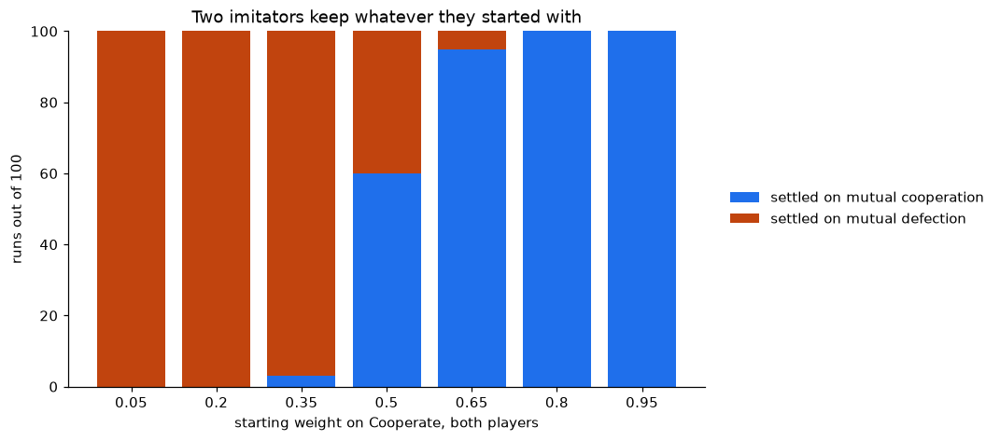

# Neurones miroirs, rejoués puis mis à l'épreuve

> [Read in English](README.md)


Le rapport affirme que le Tit-for-Tat émerge de l'imitation sans avoir été
programmé. Face à des adversaires qui réagissent, il n'en est rien. **Sur des
matchs de 10 à 100 tours, l'agent termine huitième sur huit, derrière un tirage
à pile ou face.** Ce que la mise à jour implémente est un appariement de
fréquences, et la forme close le dit avant même le premier tournoi.

Depuis la racine du dépôt, car la mesure de réciprocité y réside et est
partagée avec [`../llm/`](../llm/) :

```sh
pip install -r requirements.txt
export PYTHONPATH=.
python mirror_neurons/run_tournament.py && python mirror_neurons/plot_results.py
jupyter execute mirror_neurons/mirror_neurons_rerun.ipynb   # environ 22 secondes
```

## Les résultats

| | |
|---|---|
| **Il ne peut pas rendre la pareille, par construction** | Le poids vaut `w_i(0) * (1 + eta) ** n_i` : tout l'état tient en un couple de compteurs, et l'ordre dans lequel ils sont arrivés ne peut pas atteindre l'action suivante. Le Tit-for-Tat, lui, est fonction du seul dernier tour. [L'algèbre](design-notes/the-closed-form.md) |
| **Réciprocité de 0,123 contre 1,000 pour le Tit-for-Tat** | Mesurée comme `P(coopérer \| l'adversaire a coopéré au tour précédent)` moins `P(coopérer \| il a trahi)`, face à un sondeur. La mesure d'origine attribuait au coopérateur constant le même score qu'au Tit-for-Tat : elle a été retirée. [Pourquoi](design-notes/measuring-reciprocity.md) |
| **Et elle retombe à exactement 0,000** | Dès le tour 800, quand le Tit-for-Tat tient 1,000 sur chaque fenêtre. Exactement zéro parce que l'agent se fige en joueur constant. [Le mécanisme](design-notes/saturation.md) |
| **La dernière place dépend de la durée du match** | Au plus bas à 20 tours, 2,000 contre 2,211 pour le tirage à pile ou face. Encore dernier à 100. Sixième à 500, en se figeant et non en progressant |
| **Huitième sur huit** | Un toutes rondes de 8 joueurs, 100 tours, 20 répétitions, gains 3/1/5/0 d'Axelrod, classement au score médian par tour. [Le dispositif](design-notes/how-the-tournament-runs.md) |

Sept CSV et cinq figures dans [`results/`](results/), régénérés par
l'intégration continue à chaque poussée et comparés aux copies versionnées :
un nombre cité ici ne peut donc pas s'écarter du code qui l'a produit.

## Ce que tout cela donne



Le stage demande si les algorithmes **entretiennent** la coopération tacite, la
**rompent** ou l'**intensifient**. Soumise à ce mécanisme, la réponse est la
première, et elle seule.

Deux imitateurs face à face forment une boucle de rétroaction : ce que joue l'un
devient pour l'autre la preuve qu'il faut le jouer à son tour. Sur 100 parties
par poids initial, cette boucle a **deux états absorbants et aucun troisième
résultat.** À partir de 0,05, elle se fixe sur la défection mutuelle 100 fois sur
100, à 1,002 par tour en moyenne. À partir de 0,8, la valeur retenue par le
stage, sur la coopération mutuelle 100 fois sur 100, à 2,995 pour un plafond de
3. Le point de bascule est 0,5, et **pas une partie sur 700 ne s'est terminée
autrement que figée.**

Un marché de tels agents conserve donc le régime dans lequel on l'a placé, sans
pouvoir en sortir. **L'imitation est un cliquet sur la condition initiale, pas
une voie vers la collusion.** Elle n'inventera pas un prix collusif et ne
sortira pas non plus d'un tel prix par la concurrence. C'est plus étroit que ce
qu'avance le rapport, et c'est ce qui sépare ce mécanisme des Q-learners de
Calvano et al. (2020), qui trouvent la collusion, eux : ils lisent les gains,
ce que cet agent ne fait jamais, par construction.

Deux lectures d'un même mécanisme, donc. Face à un plateau mêlé, c'est le plus
mauvais joueur de la table, car il ne sait ni punir ni exploiter. Face à
lui-même, c'est un conformiste parfait. Les deux découlent de la même forme
close, et aucune n'est le Tit-for-Tat.

**Ce qui changerait la réponse.** L'ensemble d'actions se réduit à Coopérer ou
Trahir, et non à un prix sur un continuum. Les deux joueurs partent identiques :
les départs hétérogènes restent à tester. Enfin le verrouillage tient à des
log-cotes qui croissent sans borne : un taux d'apprentissage décroissant, ou un
plancher sur les poids, donnerait un agent qui continue de réagir. C'est cette
version-là qu'il vaut la peine de construire ensuite.

## Où se trouve le reste

Chaque module s'ouvre sur la phrase qui énonce son rôle ; voici donc seulement
la carte : [`hebbian_agent.py`](hebbian_agent.py) est le modèle et
[`axelrod_player.py`](axelrod_player.py) l'assoit face aux adversaires ;
[`measurements.py`](measurements.py) produit les nombres,
[`preflight_checks.py`](preflight_checks.py) décide s'ils sont dignes de
confiance, et [`run_tournament.py`](run_tournament.py) les écrit.

| | |
|---|---|
| [`design-notes/`](design-notes/) | Sept notes : le dispositif, l'algèbre, la mesure, la saturation, les adversaires, ce que la reprise a corrigé, et le jeu auquel cet agent ne peut pas jouer du tout |
| [`results/`](results/) | Tous les CSV et figures produits par ce dossier, par le tournoi comme par le carnet |
| [`mirror_neurons_rerun.ipynb`](mirror_neurons_rerun.ipynb) | La simulation d'origine, exécutable, avec la forme close démontrée et vérifiée |

Les notes de conception et les invites restent en anglais : les premières
s'adressent à qui lit le code, et traduire les secondes changerait l'expérience
que mènent les modèles.

Rien de tout cela n'atteint l'idée, qui est raisonnable. L'imitation comme mise
à jour de poids hebbienne est un mécanisme plausible, et elle entretient bel et
bien la coopération. Simplement, ce n'est pas un mécanisme de Tit-for-Tat, et il
aura fallu des adversaires qui réagissent pour le voir.
