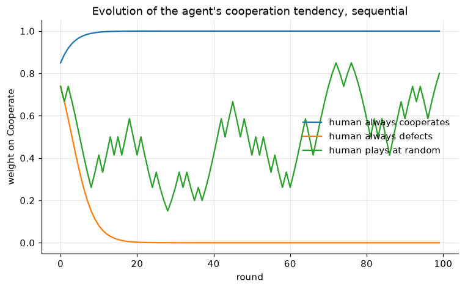

# Mirror neurons, rerun



Reruns the simulation from
[`../original/Neurones_Mirroirs/`](../original/Neurones_Mirroirs/), which is
preserved untouched.

```sh
pip install -r requirements.txt
jupyter execute mirror_neurons_rerun.ipynb
```

## The idea

Mirror neurons fire both when you act and when you watch someone else act, which
makes them a plausible substrate for imitation. The agent here is that idea at
its simplest: two weights, one per action, and observing the human play an
action multiplies that action's weight by `1 + η` and renormalises. Nothing
tells it to reciprocate. Tit-for-Tat is meant to fall out of the update itself.

**The model is unchanged from the original.** Everything corrected here is around
it.

## What was corrected

| | |
|---|---|
| The last cell was `while(True)` around `input()` | Any run-all hung there forever. It is a scripted exchange now |
| Three of five figures had no `legend()` | They computed a per-curve `η` label and discarded it, rendering four indistinguishable lines |
| All nine execution counts were `null` | No record of what produced the committed figures, or in what order |
| The draws were unseeded | No run reproduced any other |
| No markdown cells at all | The notebook explained nothing |

## One correction to the write-up, with a figure


The PDF describes the weight's growth as concave. The rule is the logistic map,
so the trajectory is concave only above 0.5 and convex below it. It looks
concave in the original figures because the weight starts at 0.8, already past
the inflection. Starting from 0.2, the same rule is convex for the first few
observations.

## Two claims the simulation does not support

Recorded because the write-up sits next to this and a reader will read both.

- It says the agents *"se rapproche du comportement humain"*. There is no human
  data anywhere in the simulation. The agent plays three hardcoded fixed
  policies, one of which is a coin flip. Resemblance to a human is never tested.
- It says the parameters are *"basées sur des données empiriques"* from Ng
  (2023). They are `2**0.5 - 1` and `0.8`, neither traceable to that paper nor
  to any measurement.

Neither undermines the idea, which is a reasonable one. They are claims the code
was never asked to check.

## What comes next

The first of those two is the gap worth closing: give the agent opponents that
react. [Axelrod-Python](https://github.com/Axelrod-Python/Axelrod) supplies them
from the literature, along with the match engine and the payoff bookkeeping.

| | |
|---|---|
| [`hebbian_agent.py`](hebbian_agent.py) | The model, lifted out of the notebook so both callers play the same object |
| [`axelrod_player.py`](axelrod_player.py) | It as an Axelrod player, plus a measure of how close its play is to Tit-for-Tat |
| [`tournament_config.py`](tournament_config.py) | The seven opponents, the payoffs, the seed and the learning rates |
| [`design-notes/`](design-notes/) | Where the games and opponents come from, and the two places the model does not reach |

Scaffolding only. No tournament has been run and no result is committed here.
