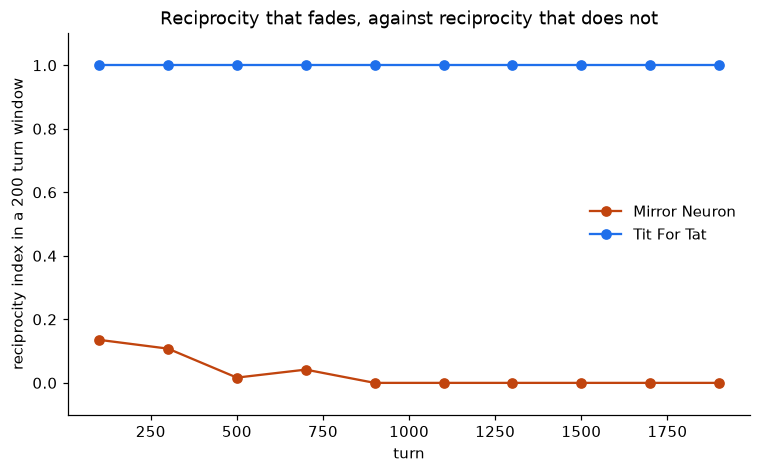

# Mirror neurons, rerun and then tested


The report's claim is that Tit-for-Tat emerges from imitation without being
programmed. Given opponents that react, it does not. **The agent finishes eighth
of eight, behind a coin flip**, and the reciprocity it appears to have is a
transient of the opening rounds.

```sh
pip install -r requirements.txt
python run_tournament.py && python plot_results.py   # about 8 seconds
jupyter execute mirror_neurons_rerun.ipynb
```

## What emerges is frequency matching, not Tit-for-Tat

Observing an action multiplies its weight by `1 + eta` and renormalises. The
notebook now derives what that recursion is in closed form, and the derivation
settles the question before any tournament runs:

```
w_i  proportional to  w_i(0) * (1 + eta) ** n_i
```

The agent's entire state is a pair of counts, verified against the recursion to
1.1e-16, and reshuffling the same observations lands on identical weights to the
same precision. **A rule that cannot see order cannot implement Tit-for-Tat**,
which is a function of the last round alone. Named, it is a Boltzmann
distribution over observation counts at inverse temperature `log(1 + eta)`: the
multiplicative-weights family of Cesa-Bianchi, Gentile and Lugosi (2017), which
is reference 4 of [`../original/Litterature/`](../original/Litterature/) and is
never cited in the report that needed it. It also gives `eta = sqrt(2) - 1` a
reading, since it makes the odds double every two net observations, though not
the empirical grounding the report claims for it.

## The measure had to be replaced first

The measure this folder started with gave 1.000 to Tit-for-Tat and 1.000 to a
constant cooperator alike, so it scored convergence rather than reciprocity.
What replaces it is `P(cooperate | opponent cooperated last)` minus
`P(cooperate | defected last)`, measured against Random, the one opponent that
supplies both conditions. Why, and the two ways it can still mislead, are in
[`design-notes/measuring-reciprocity.md`](design-notes/measuring-reciprocity.md).

| Player | Reciprocity | The old measure |
|---|---:|---:|
| Tit For Tat | **1.000** | 1.000 |
| Mirror Neuron | **0.123** | 0.561 |
| Random | 0.064 | 0.531 |
| Cooperator, Defector, Grudger | 0.000 | 0.544, 0.456, 0.456 |

[`run_tournament.py`](run_tournament.py) refuses to write a CSV unless
Tit-for-Tat measures 1.0 and the constant players measure 0.0 first.

## And the little it has, it loses



The closed form says the round just played reaches the next action through the
single count it increments, so its share of the evidence is one part in `n` and
falls as the match runs. Measured in windows, the agent goes 0.135, 0.108,
0.017, 0.042 and then **exactly 0.000 from turn 800 onward**, while Tit-for-Tat
holds 1.000 in every window.

Exactly zero, because the agent saturates. The count difference in what it
observes is a random walk, and once that walk pushes the log-odds past roughly
plus or minus 13 the agent becomes a constant player, which is by definition
unreciprocal. Which constant it becomes is decided by the walk rather than by
anything either player intends. Raising the learning rate does not help
([the sweep](results/learning_rate_sweep.png) peaks at 0.13 near `eta = 0.5`):
it brings the saturation forward as fast as it strengthens the response.

**One caveat, stated rather than buried.** This is a memory-one measure, so it
under-reports trigger strategies: Grudger is genuinely reciprocal and scores
0.000 here. It is the right measure for the claim under test, which is about
Tit-for-Tat, and the wrong one for reciprocity in general.

None of this touches the idea, which is a reasonable one. Imitation as a Hebbian
weight update is a plausible mechanism. It is simply not a mechanism for
Tit-for-Tat, and it took opponents that react to see that. What the rerun had to
fix before it could be asked, and the two other claims the simulation does not
support, are in
[`design-notes/what-the-rerun-corrected.md`](design-notes/what-the-rerun-corrected.md).

| | |
|---|---|
| [`hebbian_agent.py`](hebbian_agent.py) | The model, unchanged from the internship |
| [`axelrod_player.py`](axelrod_player.py) | It as an Axelrod player |
| [`reciprocity.py`](reciprocity.py) | The two measures, and why one of them was retired |
| [`run_tournament.py`](run_tournament.py) | Every number above, and the checks it refuses to write without |
| [`plot_results.py`](plot_results.py) | The figures, drawn from the committed CSVs |
| [`tournament_config.py`](tournament_config.py) | The opponents, payoffs, seed and learning rates |
| [`results/`](results/) | Five CSVs and three figures. CI regenerates them and fails on any diff |
| [`design-notes/`](design-notes/) | Where the opponents come from, and the game this agent cannot play at all |
