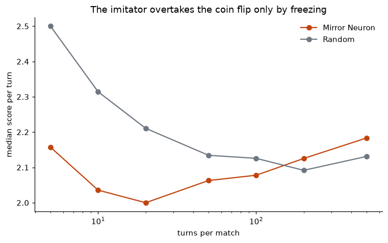

# Mirror neurons, rerun and then tested


The report's claim is that Tit-for-Tat emerges from imitation without being
programmed. Given opponents that react, it does not. **Over matches of 10 to
100 turns the agent finishes eighth of eight, behind a coin flip**, and the
reciprocity it appears to have is a transient of the opening rounds. It climbs
out of last place only in matches several hundred turns long, and then for a
reason that is not reciprocity at all.

```sh
pip install -r requirements.txt
python run_tournament.py && python plot_results.py   # about 8 seconds
jupyter execute mirror_neurons_rerun.ipynb
```

## How the tournament runs

A round robin: eight players, the agent and
[seven opponents from the literature](design-notes/opponents-and-games.md),
each meeting every other **and itself** over **100 turns**, repeated **20
times** because two of the eight draw their moves at random, this agent and
the coin flip, so a single pass would be one sample. Payoffs are Axelrod's
standard Prisoner's Dilemma, **3 for mutual cooperation, 1 for mutual
defection, 5 for defecting on a cooperator and 0 for being defected on**, which
is also what [the LLM prompt](../llm/prompts/prisoners_dilemma.md) states, so a
language model and this agent play the same game.

A player is ranked by its **median score per turn across all its matches**, so
the ranking rewards holding up against the whole field rather than beating any
one opponent. That distinction does work here: Defector wins the most
individual matches, seven, and still places third, while Tit-for-Tat wins none
and places first. The agent wins one and places last. Every match starts the
agent fresh, and the settings and seed are in
[`tournament_config.py`](tournament_config.py).

## What emerges is frequency matching, not Tit-for-Tat

Observing an action multiplies its weight by `1 + eta` and renormalises. The
notebook now derives what that recursion is in closed form, and the derivation
settles the question before any tournament runs:

```
w_i  proportional to  w_i(0) * (1 + eta) ** n_i
```

The agent's entire state is a pair of counts, verified against the recursion to
1.1e-16, and reshuffling the same observations lands on identical weights to the
same precision. **A rule that cannot see order cannot implement Tit-for-Tat**,
which is a function of the last round alone. Named, it is a Boltzmann
distribution over observation counts at inverse temperature `log(1 + eta)`: the
multiplicative-weights family of Cesa-Bianchi, Gentile and Lugosi (2017), which
is reference 4 of [`../original/Litterature/`](../original/Litterature/) and is
never cited in the report that needed it. It also gives `eta = sqrt(2) - 1` a
reading, since it makes the odds double every two net observations, though not
the empirical grounding the report claims for it.

Measuring it needed a new number first. The one this folder started with gave
1.000 to Tit-for-Tat and 1.000 to a constant cooperator alike, so it scored
convergence rather than reciprocity. What replaces it is
`P(cooperate | opponent cooperated last)` minus `P(cooperate | defected last)`,
against Random, the one opponent supplying both conditions.

| Player | Reciprocity | The old measure |
|---|---:|---:|
| Tit For Tat | **1.000** | 1.000 |
| Mirror Neuron | **0.123** | 0.561 |
| Random | 0.064 | 0.531 |
| Cooperator, Defector, Grudger | 0.000 | 0.544, 0.456, 0.456 |

It is memory-one, so it under-reports trigger strategies, and no CSV is written
until it scores players whose reciprocity is known by construction. Both, and
the reading of Grudger it refuses to make, are in
[`design-notes/measuring-reciprocity.md`](design-notes/measuring-reciprocity.md).

## And the little it has, it loses


The closed form says the round just played reaches the next action through the
single count it increments, so its share of the evidence is one part in `n` and
falls as the match runs. Measured in windows, the agent goes 0.135, 0.108,
0.017, 0.042 and then **exactly 0.000 from turn 800 onward**, while Tit-for-Tat
holds 1.000 in every window.

Exactly zero is saturation, not noise. The counts it observes drift as a random
walk, and once the log-odds go far enough the agent is a constant player, whose
two conditional probabilities are identically equal. Raising the learning rate
does not buy the reciprocity back.



**Which is why the standing depends on how long a match runs, and quoting one
length as the result was wrong of this write-up.** The agent is worst at **20
turns**, scoring 2.000 against the coin flip's 2.211, and stays last through
100. By 200 it has passed the coin flip; by 500 it is sixth and the coin flip
is last.

That reversal is the agent stopping, not improving. Frequency matching converges
on whatever the opponent plays most, so it freezes into cooperating with
cooperators and defecting against defectors, which beats a coin flip against a
field of reciprocators. A serviceable policy, reached by ceasing to respond, and
only after hundreds of rounds. The mechanism and the per-opponent freezing are
in [`design-notes/saturation.md`](design-notes/saturation.md).

## What it adds up to


The internship asks whether algorithms **sustain** tacit cooperation, **break**
it, or **intensify** it. Put to this mechanism, the answer is the first, and
only the first.

Two imitators facing each other are a positive feedback loop: whatever one
plays becomes the other's evidence for playing it next. Over 100 runs at each
starting weight, that loop has **two absorbing states and no third outcome**.
From 0.05 it settles on mutual defection 100 times out of 100, averaging
1.002 a turn. From 0.8, the value the internship used, it settles on mutual
cooperation 100 times out of 100, averaging 2.995 against a ceiling of 3. The
tipping point is 0.5, where it is close to a coin toss, and **not one run in
700 ended anywhere but locked**.

So a market of these agents keeps the regime it is dropped into and cannot leave
it. **Imitation is a ratchet on the initial condition, not a route to
collusion.** It will not invent a collusive price, and it will not compete its
way out of one either. That is a narrower and more useful claim than the report
makes, and it points at the difference from Calvano et al. (2020), whose
Q-learners *do* find collusion: they read payoffs, and this agent by
construction never does.

Two readings, then, of the same mechanism. Against a mixed field it is the worst
player on the board, because it can neither punish nor exploit. Against itself it
is a perfect conformist. Both follow from the same closed form, and neither is
Tit-for-Tat.

**What would change the answer.** The action set here is Cooperate or Defect,
not a price on a continuum. Both players start identical, so heterogeneous
starts are untested. And the lock-in itself comes from log-odds that grow
without bound: a learning rate that decayed, or a weight that was floored, would
give an agent that keeps responding, and that is the version worth building next.

None of this touches the idea, which is a reasonable one. Imitation as a Hebbian
weight update is a plausible mechanism, and it does sustain cooperation. It is
simply not a mechanism for Tit-for-Tat, and it took opponents that react to see
that. What the rerun had to fix before any of it could be asked is in
[`design-notes/what-the-rerun-corrected.md`](design-notes/what-the-rerun-corrected.md).

Each module opens with the one sentence that says what it is for, so this is
only the map between them: [`hebbian_agent.py`](hebbian_agent.py) is the model
and [`axelrod_player.py`](axelrod_player.py) seats it against opponents;
[`measurements.py`](measurements.py) produces the numbers,
[`preflight_checks.py`](preflight_checks.py) decides whether they can be
trusted, and [`run_tournament.py`](run_tournament.py) writes them out.

| | |
|---|---|
| [`results/`](results/) | Every CSV and figure this folder produced, from the tournament and from the notebook alike. CI regenerates the CSVs and fails on any difference |
| [`design-notes/`](design-notes/) | The decisions behind all of it: where the opponents come from, how reciprocity is measured, what the rerun corrected, and the game this agent cannot play at all |
| [`mirror_neurons_rerun.ipynb`](mirror_neurons_rerun.ipynb) | The original simulation, runnable, with the closed form derived and asserted |
